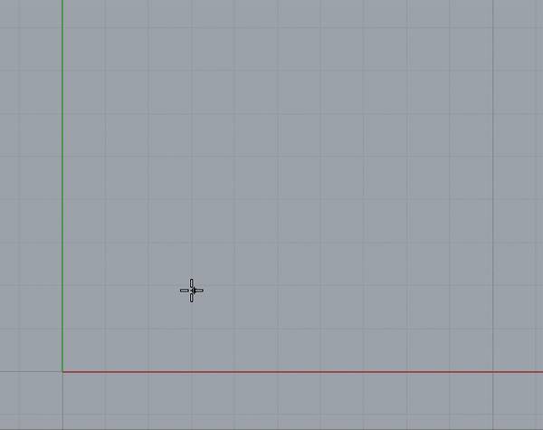

# rhino-tic-tac-toe

Tic-Tac-Toe game for [Rhino 3D](https://www.rhino3d.com).



## Installation


1. Drop script files to the directory:

    for macOS:
    ```
    /Users/HOME/Library/Application Support/McNeel/Rhinoceros/6.0/Scripts
    ```
    for Windows:

    ```
    C:\Users\UserName\AppData\Roaming\McNeel\Rhinoceros\6.0\scripts
    ```

2. Run script via command:
    ```
    ! _-RunPythonScript ScriptName

    ```

## License

Distributed under the MIT License.

## Contact

Project Link: [https://github.com/vlmarch/rhino-tic-tac-toe](https://github.com/vlmarch/rhino-tic-tac-toe)
